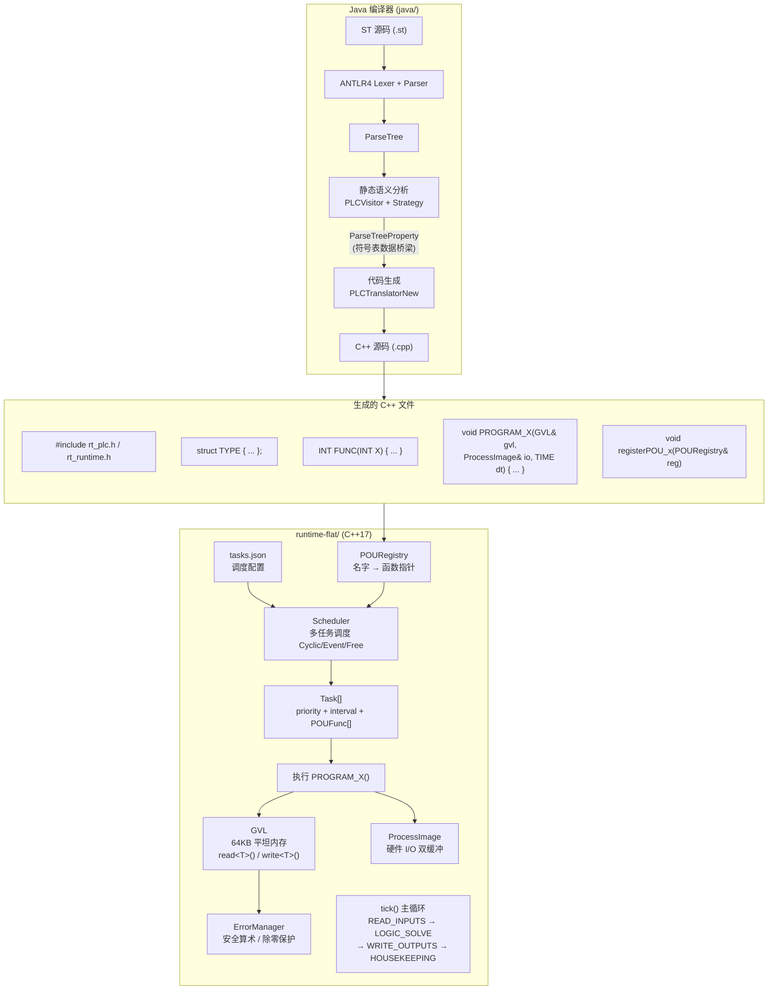
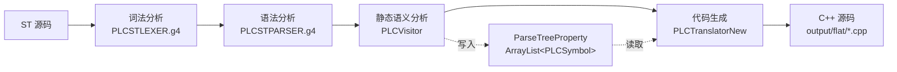
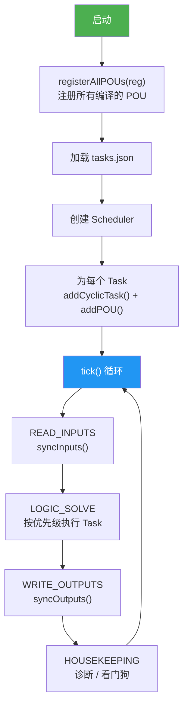
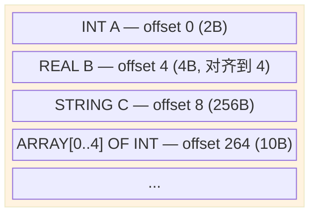

# ST2C++ — IEC 61131-3 Structured Text to C++ Transpiler

将 IEC 61131-3 结构化文本（ST）编译为 C++ 代码，由实时运行时（runtime-flat）执行。面向工业 PLC 控制场景。

## 系统架构



## 编译流程



## 运行时调度



## GVL 内存模型



| 变量 | 类型 | 大小 | 对齐后偏移 |
|------|------|------|-----------|
| A | INT | 2B | 0 |
| B | REAL | 4B | 4（跳过 2-3） |
| C | STRING | 256B | 8 |
| D | ARRAY[0..4] OF INT | 10B | 264 |

## 核心数据流

| ST 源码 | 编译器内部 | 生成的 C++ |
|---------|-----------|-----------|
| `VAR A : INT := 42;` | PLCVariable(A, INT) | `gvl.write<INT>(0, (42));` |
| `B := A + 10;` | assignVar = RFM 中间表达式 | `gvl.write<INT>(2, gvl.read<INT>(0) + (10));` |
| `FOR I := 0 TO 4 DO` | 遮盖 GVL 变量 I | `INT I = (0); for(...){ ... }` |
| `END_FOR` | 局部副本 + 写回 | `gvl.write<INT>(offset, I);` |

## 快速开始

### 环境要求

| 工具 | 版本 | 用途 |
|------|------|------|
| Java | 8+ | 运行编译器 |
| Maven | 3.x | 构建编译器 |
| MinGW | GCC 7+ | 编译 C++ |
| CMake | 3.10+ | 构建运行时 |

### 手动构建

```bash
# 1. 构建 JAR（首次）
cd java
mvn package -DskipTests
# 产出: target/st2c-jar-with-dependencies.jar

# 2. ST → C++
java -jar target/st2c-jar-with-dependencies.jar \
  --input ../examples/test.st --output-dir ../output/flat/build

# 3. CMake 构建 C++
cd runtime-flat/build
cmake .. -G "MinGW Makefiles" -DGEN_CPP_DIR=../../output/flat/build
cmake --build .

# 4. 运行
./runtime.exe
```

## 项目结构

```
ST2C-master/
├── java/                        # Java 编译器
│   └── src/main/java/
│       ├── Main.java            # 入口
│       ├── antlr4/              # ANTLR 生成的 Lexer/Parser
│       ├── staticCheckVisitor/  # 语义检查 + 表达式预组装
│       ├── PLCTranslator/       # 代码生成器
│       │   ├── PLCTranslatorNew.java   # 主调度器
│       │   ├── GvlContext.java         # GVL 偏移量 + SIZE_MAP + toNativeType
│       │   ├── CompilerConfig.java     # 编译器配置
│       │   ├── PLCTargetFile.java      # 文件输出辅助
│       │   └── TranslateType/          # 各语法节点翻译器（59 个类）
│       ├── PLCSymbolAndScope/   # 符号表 + 作用域栈
│       ├── PLCException/        # 异常体系
│       └── com/st2c/lsp/        # LSP 服务器
├── runtime-flat/                # C++17 实时运行时
│   ├── include/
│   │   ├── rt_plc.h             # 类型系统 + 功能块 + 内置函数
│   │   ├── rt_runtime.h         # 调度器 + GVL + 生命周期
│   │   └── core/                # GVL, ErrorManager, Task, Registry
│   ├── src/                     # 调度器、程序、任务实现
│   ├── tests/                   # 框架测试（124 项）
│   └── CMakeLists.txt
├── examples/                    # ST 示例程序
├── output/flat/                 # 编译器输出的 .cpp 文件
├── tasks.json                   # 调度配置
├── README.md                    # 本文件
├── CONTRIBUTING.md              # 开发指南、环境搭建、编码规范
├── docs/
│   ├── compiler-to-runtime.md   # 编译器→运行时接口文档
│   ├── architecture.md          # 架构详解（类图、序列图）
│   ├── target-deployment.md     # 目标平台部署指南
│   ├── runtime-api.md           # 运行时 API 参考手册
│   ├── examples-index.md        # 43 个示例 ST 文件索引
│   └── PLC运行时架构知识库.md    # PLC 架构背景知识
└── AGENTS.md                    # AI 代理指令
```

## 文档导航

| 文档 | 用途 |
|------|------|
| [本文件](README.md) | 项目入口、架构概览、快速开始 |
| [架构详解](docs/architecture.md) | 类图、序列图、状态图、依赖图（Mermaid） |
| [编译器→运行时接口](docs/compiler-to-runtime.md) | 编译流程、接口契约、表达式转换、GVL 偏移量 |
| [目标平台部署指南](docs/target-deployment.md) | 各平台构建/运行/部署命令、定时器配置、GPIO 映射 |
| [运行时 API 参考](docs/runtime-api.md) | Scheduler、ProcessImage、GVL、ErrorManager 等完整 API |
| [ST 语言支持](docs/st-language-support.md) | 已支持/部分支持/未支持的 ST 语法特性 |
| [示例索引](docs/examples-index.md) | 43 个示例 ST 文件分类说明 |
| [开发指南](CONTRIBUTING.md) | 环境搭建、如何加新语法/类型/FB、编码规范 |
| [PLC 运行时架构知识库](docs/PLC运行时架构知识库.md) | 工业 PLC 架构背景知识 |
| [Runtime 文档](runtime-flat/docs/README.md) | 运行时目录结构、构建、开发指南 |

## 许可证

见 [LICENSE](LICENSE)  [COPYING](COPYING)。
