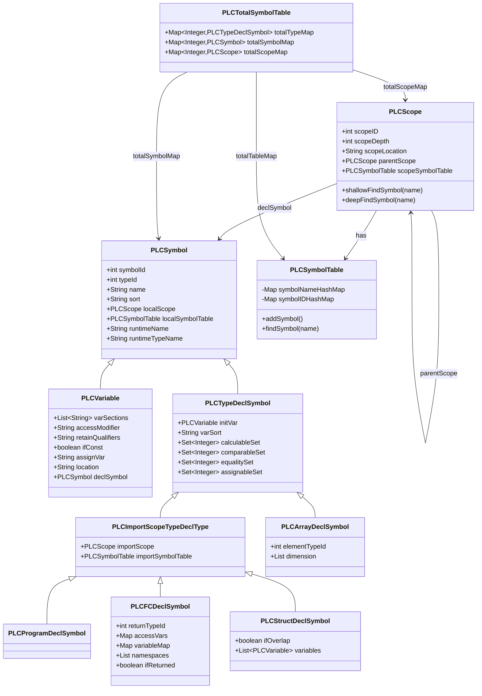
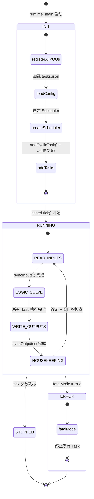
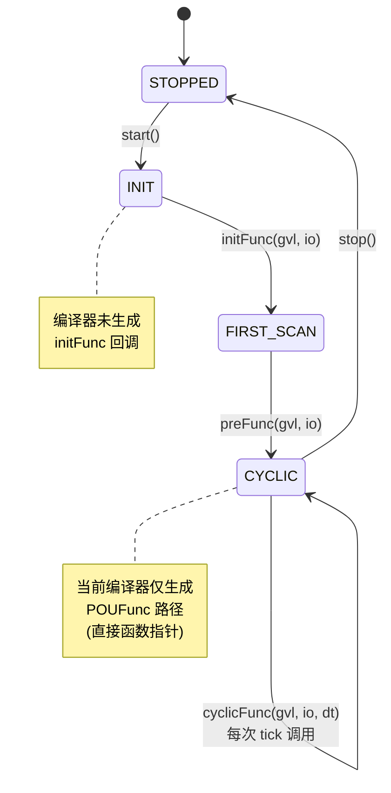
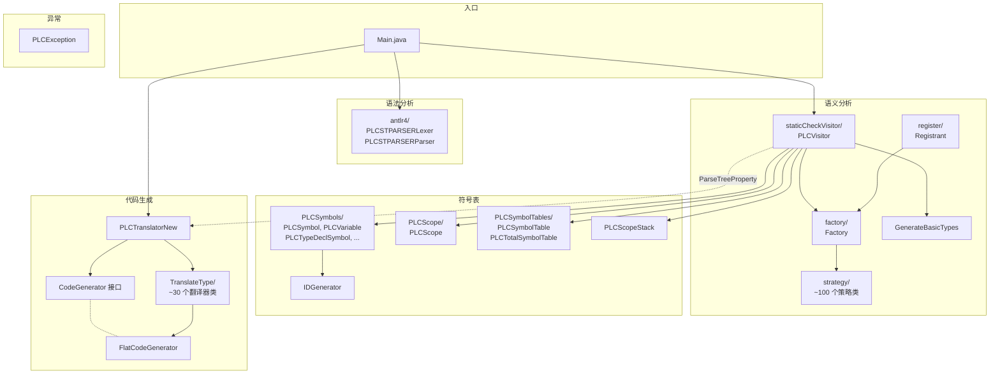
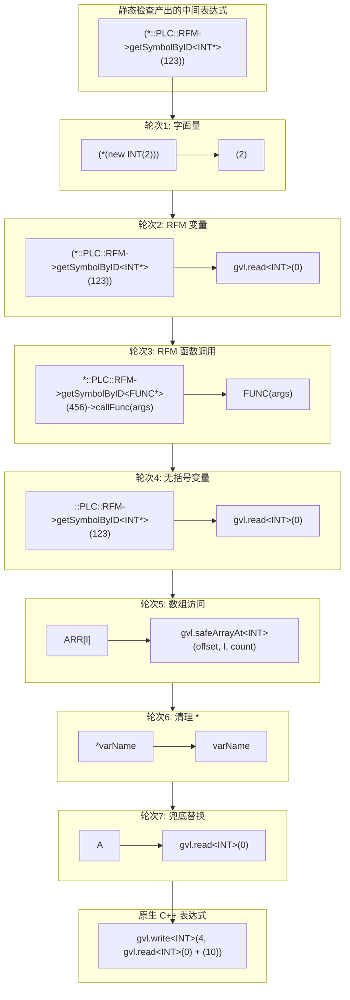
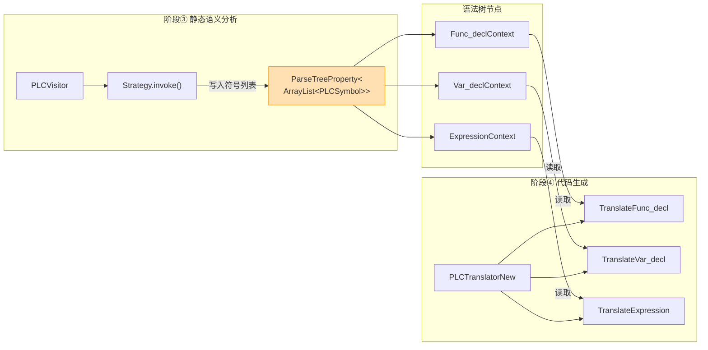

# ST2C++ 架构详解

## 1. 符号表类图

Java 编译器的核心数据模型。静态分析阶段构建，代码生成阶段消费。



## 2. 完整编译+执行序列图

一条 `C := A + B;` 从 ST 源码到运行时执行的全链路：

```mermaid
sequenceDiagram
    participant User as 用户/Editor
    participant Main as Main.java
    participant Lexer as PLCSTPARSERLexer
    participant Parser as PLCSTPARSERParser
    participant Visitor as PLCVisitor<br/>(静态语义分析)
    participant Factory as Factory<br/>(策略注册表)
    participant Strategy as VisitVariableAssignExpression
    participant Translator as PLCTranslatorNew<br/>(代码生成)
    participant CodeGen as FlatCodeGenerator
    participant File as output/flat/main.cpp
    participant CMake as CMake + GCC
    participant Runtime as runtime.exe
    participant Scheduler as Scheduler
    participant GVL as GVL.memory[64KB]

    User->>Main: --input test.st --output main.cpp
    Main->>Main: Registrant.autoRegister()<br/>扫描 @StrategyForVisit 注解

    rect rgb(230, 240, 255)
        Note over Main,Parser: 阶段阶段①②：词法+语法分析
        Main->>Lexer: CharStreams.fromFileName("test.st")
        Lexer-->>Parser: CommonTokenStream
        Main->>Parser: startpoint()
        Parser-->>Main: ParseTree
    end

    rect rgb(255, 245, 230)
        Note over Main,Strategy: 阶段③：静态语义分析
        Main->>Visitor: visit(parseTree)
        loop 每个语法树节点
            Visitor->>Factory: getStrategy(ruleIndex)
            Factory-->>Visitor: Strategy 实例
            Visitor->>Strategy: invoke(ctx, visitor)
            Strategy->>Visitor: checkNameOnly("C")<br/>checkNameOnly("A")<br/>checkNameOnly("B")
            Strategy->>Visitor: resolveType("INT")<br/>在作用域链中查找
            Strategy->>Visitor: inferType(A+B) → INT
            Strategy-->>Visitor: ArrayList~PLCSymbol~
            Note right of Visitor: 写入 ParseTreeProperty<br/>attach 到节点
        end
    end

    rect rgb(230, 255, 230)
        Note over Translator,CodeGen: 阶段④：代码生成
        Main->>Translator: visit(parseTree)
        loop 每个语法树节点
            Translator->>CodeGen: emitVarDecl("A", "INT", "42")
            CodeGen->>CodeGen: allocateOffset("A", "INT")<br/>offset=0, currentOffset=2
            CodeGen-->>Translator: ""
            Translator->>CodeGen: emitVarDecl("B", "INT", "10")
            CodeGen->>CodeGen: allocateOffset("B", "INT")<br/>offset=2, currentOffset=4
            CodeGen-->>Translator: ""
            Translator->>CodeGen: emitVarDecl("C", "INT", null)
            CodeGen->>CodeGen: allocateOffset("C", "INT")<br/>offset=4, currentOffset=6
            CodeGen-->>Translator: ""
            Translator->>CodeGen: emitAssign("C", "A+B")
            CodeGen->>CodeGen: translateExpr("A+B")<br/>RFM → gvl.read
            CodeGen->>CodeGen: writeExpr("C", "expr")
            CodeGen-->>Translator: "gvl.write&lt;INT&gt;(4, gvl.read&lt;INT&gt;(0)+gvl.read&lt;INT&gt;(2))"
        end
        Translator-->>Main: fullCode (完整 C++ 字符串)
    end

    Main->>File: BufferedWriter.write(fullCode)

    rect rgb(255, 230, 240)
        Note over CMake: 阶段⑤：C++ 编译
        CMake->>CMake: gcc main.cpp + rt_plc.h + runtime sources → runtime.exe
    end

    rect rgb(240, 230, 255)
        Note over Runtime,GVL: 阶段⑥：运行时执行
        Runtime->>Runtime: registerAllPOUs(reg)<br/>reg.add("MAIN", PROGRAM_MAIN)
        Runtime->>Scheduler: addCyclicTask("MainTask", priority=5, interval=10ms)
        Runtime->>Scheduler: addPOU(taskIdx, PROGRAM_MAIN)
        loop tick() × 100
            Scheduler->>Scheduler: READ_INPUTS
            Scheduler->>Scheduler: LOGIC_SOLVE
            Scheduler->>GVL: PROGRAM_MAIN(gvl, io, dt)
            GVL->>GVL: read&lt;INT&gt;(0) → 42
            GVL->>GVL: read&lt;INT&gt;(2) → 10
            GVL->>GVL: write&lt;INT&gt;(4, 52)
            Scheduler->>Scheduler: WRITE_OUTPUTS
            Scheduler->>Scheduler: HOUSEKEEPING
        end
    end
```

## 3. 调度器状态图



## 4. PROGRAM 生命周期



## 5. Java 编译器包依赖图



## 6. 表达式转换：RFM → GVL



## 7. 数据桥梁：ParseTreeProperty


