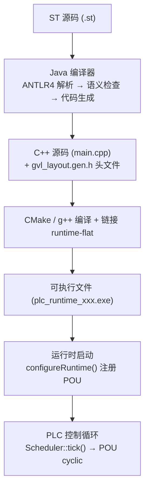
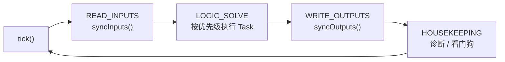

# ST2C++ 编译器到运行时的接口文档

## 概述

ST2C++ 将 IEC 61131-3 结构化文本（ST）编译为 C++ 代码，由 `runtime-flat` 实时运行时执行。两者通过以下契约解耦：

- **编译器产出**：单个 `.cpp` 文件 + `gvl_layout.gen.h` 头文件，包含 `#include "rt_plc.h"` + `#include "rt_runtime.h"`，函数签名匹配 POU 回调类型
- **运行时消费**：通过 `configureRuntime()` 注册 POU 回调，挂载到 `Scheduler` 的 `Task` 上周期执行



---

## 1. 编译流程（5 步）

### 编译管线


### 1.1 策略注册

```java
new Registrant().autoRegister();
```

通过反射扫描 `staticCheckVisitor.strategy` 包下所有 `@StrategyForVisit` 注解类，注册到 `Factory` 单例中。每个语法规则对应一个或多个策略类。

### 1.2 词法分析 + 语法分析

```
ST 源码 → PLCSTPARSERLexer → CommonTokenStream → PLCSTPARSERParser → ParseTree
```

- **入口规则**：`startpoint`
- **Lexer**（`PLCSTLEXER.g4`）：关键字定义在 `Identifier` 之前，`MS_SUFFIX`/`US_SUFFIX`/`NS_SUFFIX` 在 `Identifier` 之前（确保 `T#500ms` 中的 `ms` 优先匹配）
- **Parser**（`PLCSTPARSER.g4`）：支持 `func_decl`、`prog_decl`、`fb_decl`、`data_type_decl`、`CLASS`/`METHOD` 等语法

### 1.3 静态语义分析

```java
ParseTreeProperty<ArrayList<PLCSymbol>> property = new ParseTreeProperty<>();
PLCVisitor plcVisitor = new PLCVisitor(property);
plcVisitor.visit(parseTree);
```

`PLCVisitor` 深度优先遍历语法树，对每个节点调用对应的 `Strategy.invoke()`。主要工作：

| 工作 | 说明 |
|------|------|
| 作用域管理 | 每个 POU 声明创建新的 `PLCScope`，支持嵌套和 `USING` 命名空间导入 |
| 重名检查 | `VisitorTool.checkNameOnly()` 验证当前作用域内无同名符号 |
| 类型解析 | 沿作用域链查找类型名（INT、REAL、用户自定义 STRUCT、FB 类型等） |
| 类型兼容性 | 表达式类型推断与检查（TIME 类型支持，AND/OR 支持 ANY_BIT 多态） |
| 符号 ID 分配 | 每个变量、函数、类型通过 `IDGenerator` 获得唯一整数 ID |
| 中间表达式构建 | 语义分析器预组装表达式字符串（如 `*(Robot.Planner.PROGRESS)`），代码生成阶段净化并转换 |

### 1.4 代码生成

```java
PLCTranslatorNew translatorNew = new PLCTranslatorNew(property, gvlCtx);
String fullCode = translatorNew.visit(parseTree);
```

`PLCTranslatorNew` 遍历同一棵语法树，对每个节点创建 `TranslateXxx` 实例并调用 `translateNode()`。

**核心上下文**：`GvlContext` 管理：
- GVL 偏移量分配（`allocateOffset()`、`allocateArrayOffset()`）
- 类型映射（`SIZE_MAP` / `toNativeType()`）
- 名称重整（`getMangledName()`，格式为 `fileId$scope$varName`）
- FOR 循环遮盖（`shadowedGvlVars`）
- I/O 变量注册（`registerIOVariable()`，处理 `AT %ID0` 地址）
- Struct 布局注册（`registerStructType()`，FB 和用户自定义 STRUCT）
- 数组边界注册（`arrayBoundsMap`）
- GVL 布局头文件生成（`emitGVLLayoutHeader()`）

**代码生成按语法节点委派**：`TranslateXxx` 类（位于 `TranslateType/` 下，按 POU 类型和语句类型组织）：

| 节点类型 | 翻译器类 | 生成内容 |
|---------|---------|---------|
| `data_type_decl` | `TranslateData_type_decl` | C++ struct/enum |
| `fb_decl` | `TranslateFb_decl` | C++ struct + `update()` 方法 |
| `prog_decl` | `TranslateProg_decl` | `_init` / `_cyclic` / `_pre` / `_post` 函数 |
| `variable_access` | `TranslateVariable_access` | GVL 读取 / I/O 读取 |
| `variableAssignExpression` | `TranslateVariableAssignExpression` | 赋值语句 |
| `callFunc` | `TranslateCallFunc` | FB 调用（`emitFBCall` / `emitFBArrayCall`） |

**GVL 变量在 PROGRAM 中与在 FB 方法中的访问模式不同**：

| 上下文 | 机制 | 示例 |
|--------|------|------|
| PROGRAM 函数 | 通过 `GVL_LAYOUT` struct 直接成员访问 | `auto& gv = rt_plc::gvl_layout(gvl);`<br/>`gv.robot$gbl$Var = 42;` |
| FB 方法 | 通过 `gvl.read/write/ptr<T>(offset)` 偏移量访问 | `gvl.read<INT>(4)`<br/>`gvl.write<WORD>(0, val)`<br/>`gvl.ptr<FB_TYPE>(offset)->field` |

区分依据为 `PLCTranslatorNew.inFB` 标志，由 `TranslateFb_decl` 在访问 FB body 前后设置。偏移量访问避免了 FB 类型和 `GVL_LAYOUT` struct 之间的循环依赖。

### 1.5 文件输出

```java
// 写入 main.cpp
try (BufferedWriter writer = new BufferedWriter(new FileWriter(outputFile))) {
    writer.write(fullCode);
}
// 写入 gvl_layout.gen.h（GVL_LAYOUT struct + gvl_layout() 函数）
String gvlHeader = gvlCtx.emitGVLLayoutHeader();
try (BufferedWriter writer = new BufferedWriter(new FileWriter(headerFile))) {
    writer.write(gvlHeader);
}
```

输出两个文件：
- `main.cpp` — 所有生成的 C++ 代码
- `gvl_layout.gen.h` — GVL 内存布局 struct，供 PROGRAM 函数进行 `reinterpret_cast` 直接成员访问

**包含顺序**：`#include "gvl_layout.gen.h"` 在 `TranslateProg_decl` 中插入（位于 PROGRAM 函数之前，此时所有 FB struct 已定义），`Main.java` 中另有一个兜底调用（针对无 PROGRAM 的项目）。由 `emitGVLLayoutIncludeOnce()` 确保全局仅输出一次。

---

## 2. 编译器与运行时的接口契约

### 2.1 POU 函数签名

编译器为每个 PROGRAM 生成三个生命周期函数（定义在 `task.h`）：

```cpp
typedef void (*POUFunc)(GVL& gvl, ProcessImage& io, TIME cycleTimeUs);
```

生成的 PROGRAM 示例：

```cpp
// _init — 冷启动时调用一次（变量初始化、RETAIN 加载）
void PROGRAM_robot_ROBOT_MAIN_init(GVL& gvl, ProcessImage& io) {
    auto& gv = rt_plc::gvl_layout(gvl);
    gv.robot$ROBOT_MAIN$Robot.START = false;
    // ...
}

// _cyclic — 每个周期调用
void PROGRAM_robot_ROBOT_MAIN_cyclic(GVL& gvl, ProcessImage& io, TIME dt) {
    auto& gv = rt_plc::gvl_layout(gvl);
    gv.robot$ROBOT_MAIN$Robot.update(gvl, io, dt);
    // ...
}

// _pre — 逻辑求解前调用
void PROGRAM_robot_ROBOT_MAIN_pre(GVL& gvl, ProcessImage& io) {}

// _post — 逻辑求解后调用（RETAIN 保存）
void PROGRAM_robot_ROBOT_MAIN_post(GVL& gvl, ProcessImage& io) {
    gvl.saveRetain();
}
```

FUNCTION_BLOCK 编译为 C++ struct，内含 `update()` 方法：

```cpp
struct SAFETY_MONITOR {
    BOOL E_STOP_IN = false;
    BOOL SrvReady[6];
    // ...
    void update(GVL& gvl, ProcessImage& io, TIME dt) {
        // FB 方法内用 gvl.read/write/ptr 偏移量访问 GVL 变量
        gvl.write<DINT>(24, gvl.read<INT>(28));
    }
};
```

### 2.2 GVL — 平坦内存模型

运行时提供 64KB 的全局变量表（`runtime-flat/include/core/gvl.h`）：

```cpp
struct alignas(64) GVL {
    alignas(64) uint8_t memory[65536];
    size_t highWaterMark = 0;
    ErrorManager* errorMgr = nullptr;
    // RETAIN 支持
    size_t retainStart = 0;
    size_t retainEnd   = 0;
    uint8_t retainBackup[65536];
    // ...
};
```

编译器为每个 ST 变量分配一个固定的字节偏移量。运行时通过模板方法访问：

| 方法 | 用途 | 使用场景 |
|------|------|---------|
| `gvl.read<T>(offset)` | 读取值 | FB 方法、旧式代码 |
| `gvl.write<T>(offset, val)` | 写入值 | FB 方法、旧式代码 |
| `gvl.ptr<T>(offset)` | 获取类型化指针 | FB 方法中访问 struct/array 成员 |
| `gvl.safeArrayAt<T>(offset, idx, count)` | 数组元素访问（越界检查） | 旧式代码 |

**GVL_LAYOUT struct**：编译器生成的 `gvl_layout.gen.h` 定义了与 GVL 内存布局一一对应的 struct：

```cpp
struct GVL_LAYOUT {
    DINT  robot$gbl$Srv1CmdPos;    // offset 0
    WORD  robot$gbl$Srv1Status;    // offset 4
    // ...
    SERVO_STATE robot$gbl$SrvState[6];  // 结构体数组
    ROBOT_CTRL  robot$ROBOT_MAIN$Robot; // PROGRAM 级 FB 实例
};
inline GVL_LAYOUT& gvl_layout(GVL& gvl) {
    return *reinterpret_cast<GVL_LAYOUT*>(gvl.memory);
}
```

PROGRAM 函数通过 `auto& gv = rt_plc::gvl_layout(gvl)` 获得类型化引用，直接访问成员（生成可读性更好的代码）。

> **设计决策**：FB 方法不使用 `gvl_layout()`。原因是 FB struct（如 `ROBOT_CTRL`）同时也是 `GVL_LAYOUT` 的成员类型，但 `GVL_LAYOUT` 的完整定义必须出现在所有 FB struct 之后（避免循环依赖）。FB 方法使用 `gvl.read/write/ptr<T>(offset)` 通过编译时已知的偏移量直接访问 GVL 内存。

### 2.3 POURegistry — 名字到函数的绑定

编译器为每个文件生成注册函数（文件名由 `--file-id` 指定）：

```cpp
void registerPOU_robot(POURegistry& reg) {
    POUCallbacks cbs;
    cbs.init   = PROGRAM_robot_ROBOT_MAIN_init;
    cbs.cyclic = PROGRAM_robot_ROBOT_MAIN_cyclic;
    cbs.pre    = PROGRAM_robot_ROBOT_MAIN_pre;
    cbs.post   = PROGRAM_robot_ROBOT_MAIN_post;
    reg.add("ROBOT_MAIN", cbs);
}
```

`gen_config.py`（`target/scripts/`）扫描编译器输出目录中所有 `.cpp` 文件，生成 `runtime_config.gen.cpp` 汇总所有注册调用：

```cpp
void registerAllPOUs(POURegistry& reg) {
    registerPOU_robot(reg);
    registerPOU_other(reg);
}

void configureRuntime(Scheduler& sched, CompositeTCI& tci) {
    POURegistry reg;
    registerAllPOUs(reg);
    sched.setBaseCycle(T_us(1000));
    for (int i = 0; i < reg.count(); i++) {
        const auto& e = reg.entries()[i];
        if (e.cbs.cyclic) {
            int taskIdx = sched.addCyclicTask(e.name, 5, T_ms(10));
            int progIdx = sched.addProgram(e.name, e.cbs.init, e.cbs.cyclic, e.cbs.pre, e.cbs.post);
            if (progIdx >= 0) sched.addProgramToTask(taskIdx, progIdx);
            sched.setTaskWatchdog(taskIdx, T_ms(5));
        }
    }
}
```

### 2.4 名称重整规则

编译器使用 `fileId$scope$varName` 格式重整变量名，避免多 PROGRAM 或多文件冲突：

| ST 变量 | 作用域 | 重整后名称 |
|---------|--------|-----------|
| `Var` | VAR_GLOBAL | `fileId$gbl$Var` |
| `Var` | PROGRAM `P1` 内 | `fileId$P1$Var` |
| `Var` | PROGRAM `P2` 内 | `fileId$P2$Var` |

FB 的 `update()` 方法参数由 `emitFBCall` 处理，区分 GVL 实例与局部实例：

| FB 调用 | 位置 | 生成的代码 |
|---------|------|-----------|
| `GvlFB(...)` | PROGRAM | `gv.file$P1$GvlFB.param = val;` |
| `LocalFB(...)` | FB 方法 | `LocalFB.param = val;`（直接访问） |
| `Arr[I](...)` | PROGRAM | `gv.file$gbl$Arr[I].param = val;` |
| `Arr[I](...)` | FB 方法 | `Arr[I].param = val;`（直接访问） |

数组参数使用 `memcpy` 而非 `=`（C++ 中 C 风格数组不支持直接赋值）。

---

## 3. GVL 偏移量分配算法

编译器在 `GvlContext.allocateOffset()` 中按顺序为变量分配偏移：

```java
public int allocateOffset(String varName, String nativeType) {
    int size = getTypeSize(nativeType);
    int aligned = (currentOffset + size - 1) / size * size;  // 对齐到类型边界
    offsetMap.put(varName, aligned);
    typeMap.put(varName, nativeType);
    varProgramMap.put(varName, currentProgram);  // 记录所属 PROGRAM
    currentOffset = aligned + size;
    return aligned;
}
```

### 类型大小表

| 类型 | 字节 | 对齐 |
|------|------|------|
| SINT, USINT, BOOL | 1 | 1 |
| INT, UINT | 2 | 2 |
| DINT, UDINT, REAL | 4 | 4 |
| LINT, ULINT, LREAL, TIME | 8 | 8 |
| STRING | 256 | 1 |
| STRUCT | 字段对齐后累加 | 最大字段对齐 |

### 分配示例

变量 `A: INT`, `B: REAL`, `C: STRING`：

| 变量 | 类型 | 大小 | 对齐后偏移 | 占用字节 |
|------|------|------|-----------|---------|
| A | INT | 2 | 0 | 0-1 |
| B | REAL | 4 | 4（跳过 2-3） | 4-7 |
| C | STRING | 256 | 8 | 8-263 |

**总计**：264 字节

### 数组分配

`ARRAY[0..4] OF INT`：连续分配 5 × 2 = 10 字节，偏移对齐到 INT 边界。`allocateArrayOffset()` 同时注册 `arrayBoundsMap` 和 `arrayElemTypeMap`。

### STRUCT 分配

编译器在代码生成前计算 STRUCT 的 `totalSize`（字段按最大对齐累加），通过 `registerStructType()` 注册到 `structLayoutMap` 和 `SIZE_MAP`，作为整体分配。

---

## 4. 表达式转换（Visitor 通道）

代码生成采用 **Visitor 通道** 进行表达式转换，不再依赖旧的 RFM 正则替换方式（`translateExpr()` 已标记为 `@Deprecated`）。

### 4.1 右侧表达式（读取）

`TranslateVariable_access.java` 处理表达式中的变量引用：

**PROGRAM 函数内（`inFB == false`）**：

| ST 表达式 | 生成的 C++ |
|----------|-----------|
| `Var`（GVL 变量） | `gv.file$gbl$Var` |
| `Var[index]`（数组） | `gv.file$gbl$Var[index]` |
| `Struct.Field`（结构体） | `gv.file$gbl$Struct.Field` |
| `Robot.Planner.Prog`（多级） | `gv.file$P1$Robot.Planner.Prog` |
| `ioVar`（AT 地址） | `io.readInput<DINT>(4)` |

**FB 方法内（`inFB == true`）**：

| ST 表达式 | 生成的 C++ |
|----------|-----------|
| `Var`（GVL 标量） | `gvl.read<INT>(offset)` |
| `Var.Field`（GVL struct） | `(*gvl.ptr<STRUCT>(offset)).Field` |
| `Var[index]`（GVL 数组） | `gvl.ptr<TYPE>(offset)[index]` |
| `localVar`（FB 成员） | `localVar`（直接访问，无前缀） |

### 4.2 左侧赋值（写入）

`TranslateVariableAssignExpression.java` 处理赋值左侧：

| ST 语句 | PROGRAM 函数 | FB 方法 |
|---------|-------------|---------|
| `Var := expr` | `gv.file$gbl$Var = expr;` | `gvl.write<INT>(offset, expr);` |
| `Var.Field := expr` | `gv.file$gbl$Var.Field = expr;` | `(*gvl.ptr<STRUCT>(offset)).Field = expr;` |
| `ioVar := expr` | `io.writeOutput<DINT>(0, expr);` | `io.writeOutput<DINT>(0, expr);` |

### 4.3 FB 调用

`TranslateCallFunc.java` 的 `emitFBCall()` 根据上下文生成不同代码：

| 场景 | 生成的代码 |
|------|-----------|
| GVL 实例 + PROGRAM | `gv.file$P1$MyFB.param = val;`<br/>`gv.file$P1$MyFB.update(gvl, io, dt);` |
| 局部实例 + FB 方法 | `MyFB.param = val;`<br/>`MyFB.update(gvl, io, dt);` |
| GVL 数组 + PROGRAM | `gv.file$gbl$Arr[i].param = val;`<br/>`gv.file$gbl$Arr[i].update(gvl, io, dt);` |
| 局部数组 + FB 方法 | `Arr[i].param = val;`<br/>`Arr[i].update(gvl, io, dt);` |

数组参数（如 `SERVO_READY := SrvReady`）自动检测并使用 `memcpy` 代替 `=`。

### 4.4 括号净化

语义分析器预组装的表达式（如 `*((Robot.Planner).PROGRESS)`）在代码生成阶段被净化：`TranslateVariable_access` 剥离所有括号、除前导 `*`，从原始语法树提取 `Robot.Planner.PROGRESS`，确保 `Robot` 在 `typeMap` 中匹配成功并重整为 `gv.file$P1$Robot`。

---

## 5. FOR 循环 GVL 遮盖机制

当 FOR 循环的控制变量是 GVL 变量时，编译器创建局部副本避免循环体内频繁读写 GVL：

**ST 源码**：
```st
FOR A := 1 TO 5 BY 1 DO
    B := A + 10;
END_FOR
```

**生成的 C++**：
```cpp
INT A = (1);                          // 局部副本，从 GVL 读初值
for( ; A <= (5); A = A + (1)){
    gvl.write<INT>(2, ADD_TEN(A));    // 循环体用局部变量 A
}
gvl.write<INT>(0, A);                 // 循环结束后写回 GVL
```

编译器通过 `shadowedGvlVars` 集合 + `shadowStack` 双端队列跟踪被遮盖的变量，`translateExpr()` 和 `TranslateVariable_access` 在转换时跳过这些变量。

---

## 6. 生成代码模式速查

### PROGRAM（新版：分阶段生命周期）

```cpp
// _init — 变量初始化 + RETAIN 加载
void PROGRAM_robot_ROBOT_MAIN_init(GVL& gvl, ProcessImage& io) {
    auto& gv = rt_plc::gvl_layout(gvl);
    gv.robot$ROBOT_MAIN$Robot.START = false;
    gvl.loadRetain();
}

// _cyclic — 每周期执行
void PROGRAM_robot_ROBOT_MAIN_cyclic(GVL& gvl, ProcessImage& io, TIME dt) {
    auto& gv = rt_plc::gvl_layout(gvl);
    gv.robot$ROBOT_MAIN$Robot.update(gvl, io, dt);
}

// _pre / _post — 扫描前后钩子
void PROGRAM_robot_ROBOT_MAIN_pre(GVL& gvl, ProcessImage& io) {}
void PROGRAM_robot_ROBOT_MAIN_post(GVL& gvl, ProcessImage& io) {
    gvl.saveRetain();
}
```

### FUNCTION_BLOCK（编译为 struct + update 方法）

```cpp
struct SERVO_CTRL {
    INT AXIS_ID;
    DINT CMD_POSITION;
    // ...
    void update(GVL& gvl, ProcessImage& io, TIME dt) {
        ACT_POSITION = gvl.read<DINT>(4);    // 偏移量访问 GVL
        gvl.write<WORD>(0, CMD_CTRL);         // 偏移量写入 GVL
        // 局部成员直接访问
        STATE = 0;
    }
};
```

### GVL 变量访问

```cpp
// PROGRAM 函数 — GVL_LAYOUT 直接成员访问
auto& gv = rt_plc::gvl_layout(gvl);
DINT pos = gv.robot$gbl$Srv1ActPos;
gv.robot$ROBOT_MAIN$Robot.STATE_OUT = 2;

// FB 方法 — 偏移量访问
DINT pos = gvl.read<DINT>(4);
INT state = gvl.read<INT>(12);
gvl.write<WORD>(0, ctrl);
```

### FB 实例调用

```cpp
// GVL 实例（PROGRAM 中）
gv.robot$gbl$Planner.SPEED_PCT = 50;
gv.robot$gbl$Planner.update(gvl, io, dt);

// 局部实例（FB 方法中）
SafetyMon.E_STOP_IN = gv.robot$gbl$EStop;
memcpy(SafetyMon.SERVO_READY, SrvReady, sizeof(SafetyMon.SERVO_READY));
SafetyMon.update(gvl, io, dt);

// 数组实例
Planner[I].CMD_POSITION = target;
Planner[I].update(gvl, io, dt);
```

### POU 注册

```cpp
void registerPOU_robot(POURegistry& reg) {
    POUCallbacks cbs;
    cbs.init   = PROGRAM_robot_ROBOT_MAIN_init;
    cbs.cyclic = PROGRAM_robot_ROBOT_MAIN_cyclic;
    cbs.pre    = PROGRAM_robot_ROBOT_MAIN_pre;
    cbs.post   = PROGRAM_robot_ROBOT_MAIN_post;
    reg.add("ROBOT_MAIN", cbs);
}

// runtime_config.gen.cpp（gen_config.py 生成）
void configureRuntime(Scheduler& sched, CompositeTCI& tci) {
    POURegistry reg;
    registerAllPOUs(reg);
    sched.setBaseCycle(T_us(1000));
    for (int i = 0; i < reg.count(); i++) {
        const auto& e = reg.entries()[i];
        if (e.cbs.cyclic) {
            int t = sched.addCyclicTask(e.name, 5, T_ms(10));
            int p = sched.addProgram(e.name, e.cbs.init, e.cbs.cyclic, e.cbs.pre, e.cbs.post);
            if (p >= 0) sched.addProgramToTask(t, p);
        }
    }
}
```

### 数组参数（FB 调用时自动 memcpy）

```cpp
// ST: SafetyMon(SERVO_READY := SrvReady, CFG := Safety);
// 生成:
memcpy(SafetyMon.SERVO_READY, SrvReady, sizeof(SafetyMon.SERVO_READY));
SafetyMon.CFG = gv.robot$gbl$Safety;
SafetyMon.update(gvl, io, dt);
```

---

## 7. 构建集成

### 完整流程

```
# 1. 编译 Java 编译器
cd java && mvn package -DskipTests

# 2. 运行测试（可选）
mvn test    # 75 单元测试 + 12 快照测试 + 36 语法覆盖测试 = 111 tests

# 3. ST → C++（多文件编译）
java -jar target/st2c-jar-with-dependencies.jar \
  --input examples/projects/robot_arm/types.st \
  --input examples/projects/robot_arm/io_config.st \
  --input examples/projects/robot_arm/main.st \
  --output-dir output/flat/build --file-id robot

# 4. 生成运行时配置（gen_config.py）
python target/scripts/gen_config.py \
  --target windows --build-dir output/flat/build

# 5. 编译 C++ 可执行文件
g++ -std=c++17 -O2 -DRT_PLATFORM_DESKTOP \
  -I runtime-flat/include \
  output/flat/build/main.cpp \
  output/flat/build/runtime_config.gen.cpp \
  runtime-flat/src/*.cpp \
  target/windows/runtime_windows.cpp \
  -lpthread -lwinmm \
  -o output/flat/build/plc_runtime_windows.exe

# 6. 运行（PLC 控制循环）
./output/flat/build/plc_runtime_windows.exe
```

### 目录结构

```
ST2C-master/
├── java/                           # Java 编译器
│   └── src/
│       ├── main/java/
│       │   ├── Main.java                     # 入口
│       │   ├── antlr4/                       # ANTLR 生成的 Lexer/Parser/Visitor
│       │   ├── staticCheckVisitor/           # 语义检查 + 表达式预组装
│       │   │   ├── register/Registrant.java  # 策略注册
│       │   │   └── strategy/                 # 按语法节点的策略实现（~50+ 类）
│       │   ├── PLCTranslator/
│       │   │   ├── PLCTranslatorNew.java     # Visitor 调度器
│       │   │   ├── GvlContext.java           # GVL 偏移量 + 类型映射 + 表达式转换
│       │   │   ├── CompilerConfig.java       # 命令行参数解析
│       │   │   └── TranslateType/            # 按语法节点的翻译器（59 个类）
│       │   ├── PLCSymbolAndScope/            # 符号表 + 作用域栈
│       │   └── PLCException/                 # 异常类
│       └── test/java/
│           ├── SnapshotTest.java             # 快照回归测试（12 cases）
│           └── SyntaxCoverageTest.java       # 语法覆盖测试（36 cases）
├── runtime-flat/                   # C++ 实时运行时（静态库）
│   ├── include/
│   │   ├── rt_plc.h                # 聚合头（ProcessImage + TCI + 安全运算宏）
│   │   ├── rt_runtime.h            # 聚合头（Scheduler + GVL + PROGRAM 生命周期）
│   │   └── core/                   # 子模块头文件
│   │       ├── gvl.h               # GVL 内存 + read/write/ptr 模板方法
│   │       ├── registry.h          # POURegistry（名字→回调绑定）
│   │       ├── scheduler.h         # Scheduler（任务调度 + 扫描阶段）
│   │       ├── task.h / program.h  # Task / PROGRAM 类型定义
│   │       └── types.h             # IEC 61131-3 类型别名
│   ├── src/                        # 运行时源文件
│   ├── tests/                      # 桌面端测试（124 framework + 60 integration）
│   └── CMakeLists.txt              # 静态库构建
├── target/                         # 平台特定运行时入口
│   ├── desktop/runtime_main.cpp    # 桌面端（json 配置读取）
│   ├── windows/runtime_windows.cpp # Windows（QPC + WaitableTimer）
│   ├── linux/runtime_linux.cpp     # Linux（timerfd + SCHED_FIFO）
│   ├── rpi/runtime_rpi.cpp         # Raspberry Pi（clock_gettime + GPIO）
│   ├── stm32h7/                    # STM32H7 裸机（DWT CYCCNT + TIM2 中断）
│   └── scripts/gen_config.py       # 构建时代码生成器
├── output/flat/build/              # 编译器输出
│   ├── main.cpp                    # 生成的 POU C++ 代码
│   ├── gvl_layout.gen.h            # GVL 内存布局 struct
│   └── runtime_config.gen.cpp      # configureRuntime()（gen_config.py 生成）
├── examples/
│   └── projects/
│       ├── robot_arm/              # 6 轴机械臂完整项目（8 文件）
│       ├── weather_station/        # 气象站项目
│       ├── smart_factory/          # 智能工厂项目
│       ├── hvac_controller/        # HVAC 控制器项目
│       └── syntax_tests/           # 语法覆盖测试用例（37 文件）
└── docs/                           # 架构文档
```

---

## 8. 完整示例走读（新版格式）

### ST 源码

```st
PROGRAM MAIN
    VAR
        Counter : DINT := 0;
        Limit   : DINT := 100;
        Running : BOOL;
    END_VAR
    IF Running THEN
        Counter := Counter + 1;
    END_IF
END_PROGRAM
```

### 编译过程

1. **语义分析** → `Counter` (DINT)、`Limit` (DINT)、`Running` (BOOL) 分配 GVL 偏移量
2. **代码生成** → `TranslateProg_decl` 生成四个生命周期函数
3. **`gvl_layout.gen.h`** 生成包含所有 GVL 变量的 struct
4. **POU 注册** → `registerPOU_test(POURegistry& reg)` 注册回调

### 生成的 C++

**gvl_layout.gen.h**:
```cpp
#pragma once
#include "core/gvl.h"

namespace rt_plc {
struct GVL_LAYOUT {
    DINT test$gbl$Counter;
    DINT test$gbl$Limit;
    BOOL test$gbl$Running;
};
inline GVL_LAYOUT& gvl_layout(GVL& gvl) {
    return *reinterpret_cast<GVL_LAYOUT*>(gvl.memory);
}
} // namespace rt_plc
```

**main.cpp**:
```cpp
// Generated by ST2C++ (Flat backend)
#include "rt_plc.h"
#include "rt_runtime.h"

using namespace rt_plc;

#include "gvl_layout.gen.h"

void PROGRAM_test_MAIN_init(GVL& gvl, ProcessImage& io) {
    auto& gv = rt_plc::gvl_layout(gvl);
    gv.test$gbl$Counter = 0;
    gv.test$gbl$Limit   = 100;
    gv.test$gbl$Running  = false;
}

void PROGRAM_test_MAIN_cyclic(GVL& gvl, ProcessImage& io, TIME dt) {
    auto& gv = rt_plc::gvl_layout(gvl);
    if (gv.test$gbl$Running) {
        gv.test$gbl$Counter = gv.test$gbl$Counter + 1;
    }
}

void PROGRAM_test_MAIN_pre(GVL& gvl, ProcessImage& io) {}
void PROGRAM_test_MAIN_post(GVL& gvl, ProcessImage& io) {}

void registerPOU_test(POURegistry& reg) {
    POUCallbacks cbs;
    cbs.init   = PROGRAM_test_MAIN_init;
    cbs.cyclic = PROGRAM_test_MAIN_cyclic;
    cbs.pre    = PROGRAM_test_MAIN_pre;
    cbs.post   = PROGRAM_test_MAIN_post;
    reg.add("MAIN", cbs);
}
```

### 运行时执行

1. `runtime_main.cpp` 启动 → `configureRuntime(sched, tci)` 注册所有 POU
2. `Scheduler::tick()` 每 1ms 调用一次 → 触发注册的 cyclic 任务
3. 每个周期：`PROGRAM_test_MAIN_cyclic(gvl, io, dt)` 执行

---

## 9. 运行时基础设施速查

### GVL 访问方法

| 方法 | 使用场景 | 说明 |
|------|---------|------|
| `gvl.read<T>(offset)` | FB 方法 | 带边界检查的值读取 |
| `gvl.write<T>(offset, val)` | FB 方法 | 带边界检查的值写入 + 高水位标记更新 |
| `gvl.ptr<T>(offset)` | FB 方法 | 获取类型化指针（用于 struct/array 成员访问） |
| `gvl.safeArrayAt<T>(offset, idx, count)` | 旧式代码 | 数组元素访问（越界返回末尾元素） |

### 标准功能块（stdlib 中定义）

| 功能块 | 说明 |
|--------|------|
| `TON` / `TOF` / `TP` | 定时器（on-delay / off-delay / pulse） |
| `CTU` / `CTD` / `CTUD` | 计数器（上 / 下 / 双向） |
| `R_TRIG` / `F_TRIG` | 边沿检测 |

### 内置函数

- **转换**：`TO_INT()`, `TO_REAL()`, `TO_DINT()`, `TO_STRING()` 等，支持所有源类型组合
- **数学**：`ABS()`（REAL）、类型化重载 `ABS_DINT()`、`ABS_REAL()` 在文体 stdlib 中定义
- **安全运算**：`safeAdd/Sub/Mul/Div/Mod()`，溢出时记录日志
- **字符串**：`CONCAT()`、`LEN()`、`MID()` 等

### 调度阶段



---

## 10. 当前状态

### 已实现

- [x] FUNCTION 声明与调用（含类型化重载 `ABS_DINT` 等）
- [x] PROGRAM 四阶段生命周期（`_init` / `_cyclic` / `_pre` / `_post`）
- [x] FUNCTION_BLOCK（编译为 C++ struct + `update()` 方法）
- [x] FB 调用（支持标量实例、数组实例、输入/输出参数）
- [x] GVL 两模式访问（PROGRAM 用 `gvl_layout()` 直接成员访问，FB 方法用 `gvl.read/write/ptr` 偏移量访问）
- [x] I/O 变量（`AT %IX0.0` / `AT %ID4` 等，翻译为 `io.readInput` / `io.writeOutput`）
- [x] CLASS / METHOD 支持
- [x] 数组类型（多维数组，`ARRAY[0..5, 0..1] OF DINT`）
- [x] STRUCT 和 ENUM 用户自定义类型
- [x] RETAIN（编译器生成 `setRetainRegion()` / `saveRetain()` / `loadRetain()` 调用）
- [x] 时间字面量（`T#500ms`、`T#1s` 等，通过 `MS_SUFFIX`/`US_SUFFIX`/`NS_SUFFIX` 词法规则）
- [x] 语法覆盖测试（`SyntaxCoverageTest`，36 个文件，编译成功验证）
- [x] 快照回归测试（`SnapshotTest`，12 个快照，精确输出比对）
- [x] FB 输出参数（`=>` 语法）读回（`emitFBCall` 在 `update()` 后将 FB 输出字段写回目标变量）
- [x] RETAIN 区域标记（编译器为 `_init` 自动计算 `setRetainRegion()` 边界，`_post` 自动调用 `saveRetain()`）

### 待完成

- [ ] `gen_config.py` 集成到 Java 编译器（直接生成 `runtime_config.gen.cpp`）
- [ ] EtherCAT PDO 绑定（`%IX0.0` → SOEM PDO 内存映射）
- [ ] 裸机平台（STM32H7、RISC-V）的 BSP 初始化
