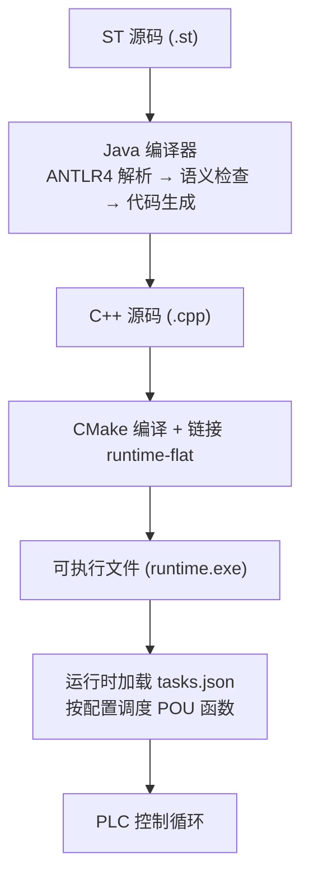
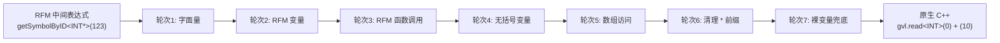
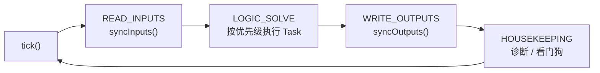

# ST2C++ 编译器到运行时的接口文档

## 概述

ST2C++ 将 IEC 61131-3 结构化文本（ST）编译为 C++ 代码，由 `runtime-flat` 实时运行时执行。两者通过以下契约解耦：

- **编译器产出**：单个 `.cpp` 文件，包含 `#include "rt_plc.h"` + `#include "rt_runtime.h"`，函数签名匹配 `POUFunc` 类型
- **运行时消费**：通过 `POURegistry` 按名字查找函数指针，挂载到 `Scheduler` 的 `Task` 上周期执行



---

## 1. 编译流程（5 步）

### 编译管线


### 1.1 策略注册

```java
new Registrant().autoRegister();
```

通过反射扫描 `staticCheckVisitor.strategy` 包下所有 `@StrategyForVisit` 注解类，注册到 `Factory` 单例中。每个语法规则（`func_decl`、`prog_decl`、`expression` 等）对应一个或多个策略类。

### 1.2 词法分析 + 语法分析

```
ST 源码 → PLCSTPARSERLexer → CommonTokenStream → PLCSTPARSERParser → ParseTree
```

- **入口规则**：`startpoint`
- **Lexer**（`PLCSTLEXER.g4`）：关键字（`ARRAY_KW`、`STRUCT_KW` 等）定义在 `Identifier` 之前，确保关键字优先匹配。标识符仅允许大写 `[A-Z][A-Z0-9$_]*`
- **Parser**（`PLCSTPARSER.g4`）：支持 `func_decl`、`prog_decl`、`fb_decl`、`data_type_decl`、`print_stmt` 等语法

### 1.3 静态语义分析

```java
ParseTreeProperty<ArrayList<PLCSymbol>> property = new ParseTreeProperty<>();
PLCVisitor plcVisitor = new PLCVisitor(property);
plcVisitor.visit(parseTree);
```

`PLCVisitor` 深度优先遍历语法树，对每个节点调用对应的 `Strategy.invoke()`。主要工作：

| 工作 | 说明 |
|------|------|
| 作用域管理 | 每个 POU 声明创建新的 `PLCScope`，支持嵌套和 `USING` 命名空间导入 |
| 重名检查 | `VisitorTool.checkNameOnly()` 验证当前作用域内无同名符号 |
| 类型解析 | 沿作用域链查找类型名（INT、REAL、用户自定义 STRUCT 等） |
| 类型兼容性 | 表达式类型推断与检查（如 INT + REAL 允许，INT + BOOL 不允许） |
| 符号 ID 分配 | 每个变量、函数、类型通过 `IDGenerator` 获得唯一整数 ID |
| 中间表达式构建 | 变量的 `assignVar` 字段存储 RFM 风格的中间表达式 |

**核心数据桥梁**：`ParseTreeProperty<ArrayList<PLCSymbol>>` — 静态检查写入，代码生成读取。每个语法树节点挂载一组 `PLCSymbol`，包含类型信息、变量属性、中间表达式等。

### 1.4 代码生成

```java
PLCTranslatorNew translatorNew = new PLCTranslatorNew(property, gvlCtx);
String fullCode = translatorNew.visit(parseTree);
```

`PLCTranslatorNew` 遍历同一棵语法树，对每个节点创建 `TranslateXxx` 实例并调用 `translateNode()`。`TranslateXxx` 从 `ParseTreeProperty` 读取符号数据，通过 `GvlContext` 查询偏移量和进行表达式转换。

**核心上下文**：`GvlContext` 管理 GVL 偏移量分配（`allocateOffset()`）、类型映射（`SIZE_MAP` / `toNativeType()`）、表达式转换（`translateExpr()`）、FOR 循环遮盖等。

### 1.5 文件输出

```java
try (BufferedWriter writer = new BufferedWriter(new FileWriter(outputFile))) {
    writer.write(fullCode);
}
System.out.println(gvlCtx.getOffsetDefinitions());  // GVL 偏移量信息输出到 stdout
```

一次性写入生成的 C++ 代码。GVL 偏移量映射输出到控制台供调试。

---

## 2. 编译器与运行时的接口契约

### 2.1 POU 函数签名

编译器生成的每个 PROGRAM 函数必须匹配以下签名（定义在 `runtime-flat/include/core/task.h`）：

```cpp
typedef void (*POUFunc)(GVL& gvl, ProcessImage& io, TIME cycleTimeUs);
```

编译器生成的示例：

```cpp
void PROGRAM_MAIN(GVL& gvl, ProcessImage& io, TIME dt) {
    gvl.write<INT>(0, (42));
    // ...
}
```

- `gvl`：全局变量表引用，所有变量通过偏移量读写
- `io`：过程映像（ProcessImage），用于硬件 I/O
- `dt`：当前扫描周期时间（微秒）

FUNCTION 函数生成为普通 C++ 函数，不接收 GVL/io：

```cpp
INT ADD_TEN(INT X) {
    return (X) + ((10));
}
```

### 2.2 GVL — 平坦内存模型

运行时提供 64KB 的全局变量表（`runtime-flat/include/core/gvl.h`）：

```cpp
struct alignas(64) GVL {
    alignas(64) uint8_t memory[65536];
    size_t highWaterMark = 0;
    ErrorManager* errorMgr = nullptr;
    // ...
};
```

编译器为每个 ST 变量分配一个固定的字节偏移量。运行时通过模板方法访问：

| 方法 | 用途 | 示例 |
|------|------|------|
| `gvl.read<T>(offset)` | 读取值 | `gvl.read<INT>(0)` → 从偏移 0 读取 2 字节 INT |
| `gvl.write<T>(offset, val)` | 写入值 | `gvl.write<INT>(0, 42)` → 写 42 到偏移 0 |
| `gvl.safeArrayAt<T>(offset, idx, count)` | 数组元素访问（越界检查） | `gvl.safeArrayAt<INT>(8, I, 5)` → 第 I 个元素 |

### 2.3 POURegistry — 名字到函数的绑定

编译器为每个 `.st` 文件生成一个注册函数：

```cpp
void registerPOU_test_print(POURegistry& reg) {
    reg.add("MAIN", PROGRAM_MAIN);
}
```

构建脚本生成 `pou_registry.gen.cpp` 汇总所有注册调用：

```cpp
extern void registerAllPOUs(POURegistry& reg) {
    registerPOU_test_print(reg);
    registerPOU_test_st(reg);
}
```

运行时启动时调用 `registerAllPOUs()`，之后通过 `reg.lookup("MAIN")` 按名字查找函数指针。

### 2.4 tasks.json — 调度配置

```json
{
    "base_cycle_us": 1000,
    "tasks": [
        {
            "name": "MainTask",
            "priority": 5,
            "interval_us": 10000,
            "watchdog_us": 5000,
            "pous": ["MAIN"]
        }
    ]
}
```

| 字段 | 说明 |
|------|------|
| `base_cycle_us` | 调度器心跳周期（微秒） |
| `tasks[].name` | 任务名 |
| `tasks[].priority` | 优先级 0-31（越小越高） |
| `tasks[].interval_us` | 循环触发间隔 |
| `tasks[].watchdog_us` | 单次执行时间上限 |
| `tasks[].pous` | 挂载的 POU 名字列表（通过 registry 查找） |

---

## 3. GVL 偏移量分配算法

编译器在 `GvlContext.allocateOffset()` 中按顺序为变量分配偏移：

```java
public int allocateOffset(String varName, String nativeType) {
    int size = getTypeSize(nativeType);
    int aligned = (currentOffset + size - 1) / size * size;  // 对齐到类型边界
    offsetMap.put(varName, aligned);
    typeMap.put(varName, nativeType);
    currentOffset = aligned + size;
    return aligned;
}
```

### 类型大小表

| 类型 | 字节 | 对齐 |
|------|------|------|
| SINT, USINT, BOOL | 1 | 1 |
| INT, UINT | 2 | 2 |
| DINT, UDINT, REAL | 4 | 4 |
| LINT, ULINT, LREAL, TIME | 8 | 8 |
| STRING | 256 | 1 |
| STRUCT | 字段对齐后累加 | 最大字段对齐 |

### 分配示例

变量 `A: INT`, `B: REAL`, `C: STRING`：

| 变量 | 类型 | 大小 | 对齐后偏移 | 占用字节 |
|------|------|------|-----------|---------|
| A | INT | 2 | 0 | 0-1 |
| B | REAL | 4 | 4（跳过 2-3） | 4-7 |
| C | STRING | 256 | 8 | 8-263 |

**总计**：264 字节

### 数组分配

`ARRAY[0..4] OF INT`：连续分配 5 × 2 = 10 字节，偏移对齐到 INT 边界。

### STRUCT 分配

编译器在代码生成前计算 STRUCT 的 `totalSize`（字段按最大对齐累加），注册到 `SIZE_MAP`，作为整体分配。

---

## 4. 表达式转换（RFM → GVL）

静态检查阶段构建的中间表达式使用 RFM 风格（旧版运行时的变量引用方式）：

```
(*::PLC::RFM->getSymbolByID<INT*>(123))
```

`GvlContext.translateExpr()` 通过多轮正则替换将其转换为原生 C++：

### 转换管线



### 转换步骤

| 轮次 | 模式 | 替换为 | 说明 |
|------|------|--------|------|
| 1 | `(*(new INT(2)))` | `(2)` | 字面量 |
| 2 | `(*::PLC::RFM->getSymbolByID<INT*>(123))` | `gvl.read<INT>(0)` | RFM 变量 → GVL 偏移读取 |
| 3 | `*::PLC::RFM->getSymbolByID<FUNC*>(456)->callFunc(args)` | `FUNC(args)` | RFM 函数调用 |
| 4 | `::PLC::RFM->getSymbolByID<INT*>(123)` | `gvl.read<INT>(0)` | 无括号的 RFM 变量 |
| 5 | `ARR[I]` | `gvl.safeArrayAt<ELEM>(offset, I, count)` | 数组元素访问 |
| 6 | 清理残余 `*` 前缀 | — | 值类型不需要解引用 |
| 7 | 裸变量名 `A` | `gvl.read<INT>(0)` | 最终兜底替换 |

### writeExpr — LHS 赋值转换

| 模式 | 生成的 C++ |
|------|-----------|
| `A := expr` | `gvl.write<INT>(0, expr)` |
| `ARR[I] := expr` | `gvl.safeArrayAt<INT>(offset, I, count) = expr` |
| `MY_STRUCT.FIELD := expr` | `gvl.write<INT>(baseOffset + fieldOffset, expr)` |
| `ARR[I].FIELD := expr` | `gvl.safeArrayAt<STRUCT>(offset, I, count).FIELD = expr` |
| `*this->returnValue := expr` | `return expr` |

---

## 5. FOR 循环 GVL 遮盖机制

当 FOR 循环的控制变量是 GVL 变量时，编译器创建局部副本避免循环体内频繁读写 GVL：

**ST 源码**：
```st
FOR A := 1 TO 5 BY 1 DO
    B := A + 10;
END_FOR
```

**生成的 C++**：
```cpp
INT A = (1);                          // 局部副本，从 GVL 读初值
for( ; A <= (5); A = A + (1)){
    gvl.write<INT>(2, ADD_TEN(A));    // 循环体用局部变量 A
}
gvl.write<INT>(0, A);                 // 循环结束后写回 GVL
```

编译器通过 `shadowedGvlVars` 集合跟踪被遮盖的变量，`translateExpr()` 在 step 7 中跳过这些变量的 GVL 替换。

---

## 6. 生成代码模式速查

### 简单变量
```cpp
gvl.write<INT>(0, (42));       // A := 42
gvl.read<INT>(0);              // 读取 A
```

### STRUCT 类型
```cpp
struct MY_POINT { INT X; INT Y; };
gvl.write<INT>(4, ((gvl.read<MY_POINT>(0).X)) + ((gvl.read<MY_POINT>(0).Y)));
```

### ARRAY 元素
```cpp
gvl.safeArrayAt<INT>(0, I, 5) = (I) * ((10));
```

### ARRAY + STRUCT 混合
```cpp
gvl.safeArrayAt<MY_POINT>(0, I, 5).X = (I) * ((10));
```

### FUNCTION 声明
```cpp
INT ADD_TEN(INT X) { return (X) + ((10)); }
```

### 外部函数原型（无 body）
```cpp
INT PRINTF(STRING FMT);
```

### PRINT 语句
```cpp
printf("C = ");
printf("%d", (int)(gvl.read<INT>(4)));
printf("\n");
```

### POU 注册
```cpp
void registerPOU_test_print(POURegistry& reg) {
    reg.add("MAIN", PROGRAM_MAIN);
}
```

---

## 7. 构建集成

### 流程

```
# 手动构建
cd java && mvn compile                            # 编译 Java 编译器
java -jar target/st2c-jar-with-dependencies.jar \ # ST → C++
  --input examples/test.st --output-dir output/flat/build
cd runtime-flat/build && cmake --build .          # CMake 构建 runtime-flat
./tests/framework_test.exe                        # 运行框架测试
```

### CMake 关键变量

```cmake
set(GEN_CPP_DIR "${CMAKE_CURRENT_SOURCE_DIR}/../output/flat/build"
    CACHE PATH "Directory containing generated POU .cpp files")
```

`GEN_CPP_DIR` 指向 Java 编译器输出的 `.cpp` 文件目录。CMake 通过 `file(GLOB)` 收集所有生成文件，与 runtime 源码一起编译链接为 `runtime` 可执行文件。

### 目录结构

```
ST2C-master/
├── java/                    # Java 编译器
│   └── src/main/java/
│       ├── Main.java                    # 入口
│       ├── PLCTranslator/
│       │   ├── PLCTranslatorNew.java    # Visitor 调度器
│       │   ├── GvlContext.java          # GVL 偏移量 + SIZE_MAP + toNativeType
│       │   ├── CompilerConfig.java      # 编译器配置
│       │   ├── PLCTargetFile.java       # 文件输出辅助
│       │   └── TranslateType/           # 各语法节点翻译器（59 个类）
│       ├── staticCheckVisitor/          # 语义检查 + 表达式预组装
│       └── PLCSymbolAndScope/           # 符号表 + 作用域栈
├── runtime-flat/            # C++ 实时运行时
│   ├── include/
│   │   ├── rt_plc.h         # 类型系统 + 功能块 + 内置函数
│   │   ├── rt_runtime.h     # 调度器 + GVL + POU 注册
│   │   └── core/            # GVL, ErrorManager, Task, Registry
│   ├── src/                 # 运行时源文件
│   ├── tests/               # 桌面端测试
│   └── CMakeLists.txt       # 构建配置
├── target/                  # 平台特定运行时入口
├── output/flat/             # 编译器输出的 .cpp 文件
├── examples/                # ST 源码示例
├── tasks.json               # 调度配置
└── docs/                    # 架构文档
```

---

## 8. 完整示例走读

### ST 源码（test_print.st）

```st
FUNCTION PRINTF : INT
    VAR_INPUT
        FMT : STRING;
    END_VAR
END_FUNCTION

PROGRAM MAIN
    VAR
        A : INT := 42;
        B : INT := 10;
        C : INT;
    END_VAR

    C := A + B;
    PRINT("C = " + C);
    PRINT(C);

    IF C = 52 THEN
        PRINT(A);
    END_IF
END_PROGRAM
```

### 编译过程

1. **符号表构建**：
   - `PRINTF` → PLCFCDeclSymbol（无 body，外部函数）
   - `A` → PLCVariable，offset=0，type=INT
   - `B` → PLCVariable，offset=2，type=INT
   - `C` → PLCVariable，offset=4，type=INT

2. **中间表达式**：
   - `C := A + B` → `assignVar = "(*::PLC::RFM->getSymbolByID<INT*>(4))" := "(*::PLC::RFM->getSymbolByID<INT*>(0)) + (*::PLC::RFM->getSymbolByID<INT*>(2))"`

3. **GVL 偏移分配**：
   - A: offset=0 (INT, 2 字节)
   - B: offset=2 (INT, 2 字节)
   - C: offset=4 (INT, 2 字节)

### 生成的 C++（test_print.st.cpp）

```cpp
// Generated by ST2C++ (Flat backend)
#include "rt_plc.h"
#include "rt_runtime.h"

using namespace rt_plc;

INT PRINTF(STRING FMT);                          // 外部函数原型

void PROGRAM_MAIN(GVL& gvl, ProcessImage& io, TIME dt) {
    gvl.write<INT>(0, (42));                     // A := 42
    gvl.write<INT>(2, (10));                     // B := 10
    gvl.write<INT>(4, (0));                      // C := 0
    gvl.write<INT>(4, (gvl.read<INT>(0)) +(gvl.read<INT>(2)) );  // C := A + B
    printf("C = ");
    printf("%d", (int)(gvl.read<INT>(4)));       // PRINT(C)
    printf("\n");
    if((gvl.read<INT>(4)) ==((52)) ){            // IF C = 52
        printf("%d", (int)(gvl.read<INT>(0)));   // PRINT(A)
        printf("\n");
    }
}
```

### 运行时执行

1. `runtime_main.cpp` 启动 → `registerAllPOUs(reg)` 注册 `PROGRAM_MAIN`
2. 加载 `tasks.json` → 创建 Task "MainTask"，priority=5，interval=10ms
3. `reg.lookup("MAIN")` → 获取 `PROGRAM_MAIN` 函数指针 → 挂载到 Task
4. `Scheduler::tick()` 每 1ms 调用一次，MainTask 每 10ms 触发一次
5. 触发时调用 `PROGRAM_MAIN(gvl, io, dt)`

---

## 9. 运行时基础设施速查

### 错误安全操作

| 包装函数 | 场景 | 行为 |
|---------|------|------|
| `safeDiv(a, b, ...)` | 除零 | 返回 0，记录日志 |
| `safeMod(a, b, ...)` | 模零 | 返回 0，记录日志 |
| `safeAdd/Sub/Mul(a, b, ...)` | 溢出 | 返回结果，记录日志 |
| `safeArrayAt<T>(offset, idx, count, ...)` | 越界 | 返回末尾元素，记录日志 |

### 标准功能块

| 功能块 | 说明 |
|--------|------|
| `TON` / `TOF` / `TP` | 定时器（on-delay / off-delay / pulse） |
| `CTU` / `CTD` / `CTUD` | 计数器（上 / 下 / 双向） |
| `R_TRIG` / `F_TRIG` | 边沿检测 |

### 类型转换

`TO_INT()`, `TO_REAL()`, `TO_DINT()`, `TO_LINT()`, `TO_BOOL()`, `TO_STRING()` 等，支持所有源类型组合的重载。

### 调度阶段



---

## 10. 待完善项
- [ ] FB（功能块）翻译
- [ ] RETAIN 区域标记（编译器生成 `setRetainRegion()` 调用）
